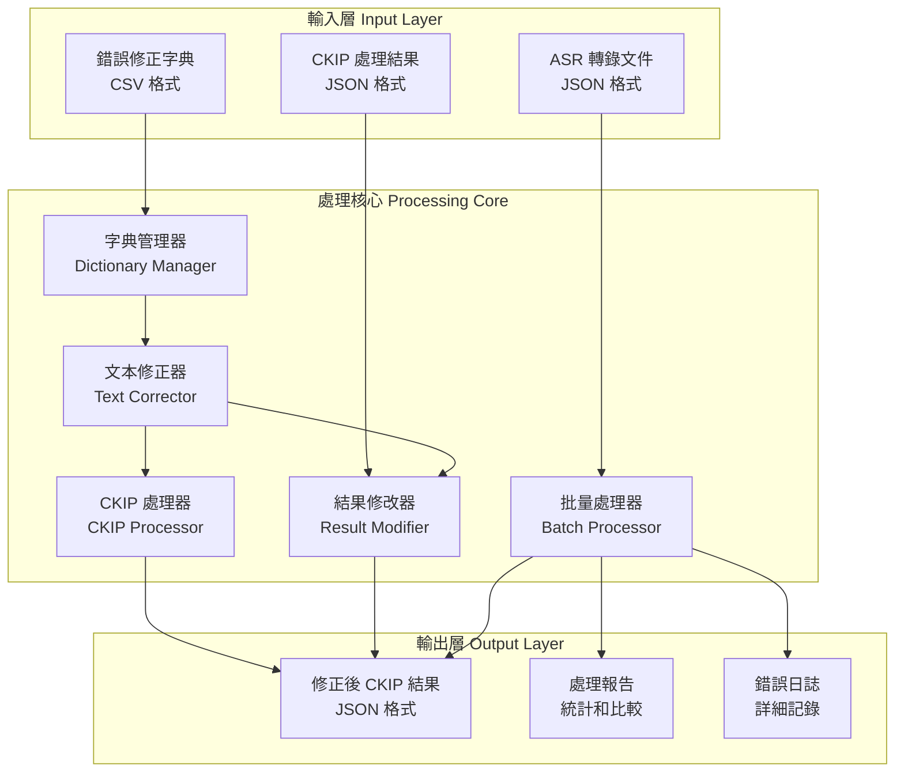
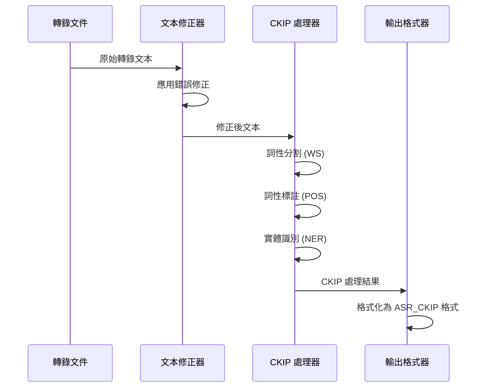
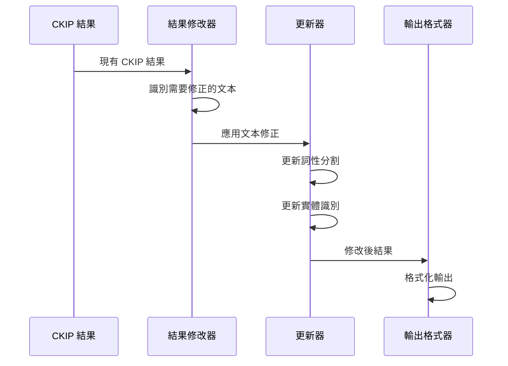

# ASR 錯誤修正專案工作流程重構

## ASR Error Correction Project Workflow Reconstruction

本文檔詳細重構 ASR 錯誤修正專案的完整工作流程，包括系統架構、處理模式、數據流向和實際操作步驟。

---

## 目錄

1. [專案概述](#1-專案概述)
2. [系統架構](#2-系統架構)
3. [核心組件](#3-核心組件)
4. [處理模式](#4-處理模式)
5. [數據流程](#5-數據流程)
6. [操作工作流程](#6-操作工作流程)
7. [輸出格式](#7-輸出格式)
8. [性能優化](#8-性能優化)
9. [錯誤處理](#9-錯誤處理)
10. [實際使用案例](#10-實際使用案例)

---

## 1. 專案概述

### 1.1 專案目標

ASR 錯誤修正專案旨在提升中文語音識別轉錄文本的準確性，通過以下方式實現：

- **字典式錯誤修正**: 使用預定義的錯誤-修正對照表
- **CKIP 自然語言處理**: 整合 CKIP transformers 進行詞性標註和實體識別
- **雙重處理模式**: 支援完整重新處理和直接結果修改
- **批量處理能力**: 高效處理大量轉錄文件

### 1.2 核心價值

```yaml
價值主張:
  準確性提升: 
    - 修正常見 ASR 錯誤 (如 "平油" → "貧鈾")
    - 改善專業術語識別 (軍事、政治領域)
    - 提高實體識別準確率
    
  效率優化:
    - 批量處理支援
    - 多種設備支援 (CPU/CUDA/MPS)
    - 智能跳過已處理文件
    
  靈活性:
    - 雙重處理模式選擇
    - 可配置的處理參數
    - 完整的驗證和比較工具
```

### 1.3 技術特色

- **與 ASR_CKIP 完全兼容**: 輸出格式完全匹配現有系統
- **OpenCC 繁簡轉換**: 智能處理繁簡體變異
- **性能監控**: 詳細的處理統計和性能報告
- **錯誤恢復**: 優雅的錯誤處理和繼續處理機制

---

## 2. 系統架構

### 2.1 整體架構圖



### 2.2 模組化設計

```python
# 系統架構的程式表示
class ASRErrorCorrectionSystem:
    """主系統類別，整合所有組件"""
    
    def __init__(self):
        # 核心組件
        self.dictionary_manager = DictionaryManager()
        self.text_corrector = TextCorrector()
        self.ckip_processor = CKIPProcessor()
        self.result_modifier = CKIPResultModifier()
        self.batch_processor = BatchProcessor()
        
        # 輔助組件
        self.output_formatter = CKIPOutputFormatter()
        self.result_comparator = ResultComparator()
        self.dictionary_validator = DictionaryValidator()
        
        # 性能優化組件
        self.hybrid_processor = HybridBatchProcessor()
        self.performance_optimizer = PerformanceOptimizer()
```

---

## 3. 核心組件

### 3.1 字典管理器 (Dictionary Manager)

**功能**: 載入、驗證和管理錯誤修正字典

```python
class DictionaryManager:
    """錯誤修正字典管理"""
    
    def __init__(self, csv_path: str):
        self.corrections = {}  # 錯誤 -> 修正 映射
        self.statistics = {}   # 統計信息
        self.converter_s2tw = create_s2twp_converter()  # 簡轉繁
        self.converter_tw2s = create_tw2s_converter()   # 繁轉簡
    
    def load_csv(self) -> bool:
        """載入 CSV 字典文件"""
        # 1. 讀取 CSV 文件
        # 2. 去重處理
        # 3. 生成繁簡體變體
        # 4. 驗證格式
        # 5. 編譯統計信息
        
    def get_correction(self, error_text: str) -> Optional[str]:
        """獲取錯誤文本的修正"""
        return self.corrections.get(error_text)
```

**處理流程**:
1. **CSV 載入**: 讀取 `error_candidates_ok.csv` (239 條記錄)
2. **去重處理**: 移除重複的錯誤-修正對
3. **變體生成**: 使用 OpenCC 生成繁簡體變體
4. **格式驗證**: 檢查特殊字符和正則表達式兼容性
5. **統計生成**: 計算字典統計信息

### 3.2 文本修正器 (Text Corrector)

**功能**: 對文本應用字典式錯誤修正

```python
class TextCorrector:
    """文本錯誤修正引擎"""
    
    def correct_text(self, text: str) -> CorrectionResult:
        """修正文本中的錯誤"""
        # 1. 按長度排序錯誤詞 (長詞優先)
        # 2. 逐一應用修正
        # 3. 記錄修正位置和內容
        # 4. 返回修正結果
        
    def correct_transcript_data(self, transcript: Dict) -> Tuple[Dict, Dict]:
        """修正整個轉錄文件"""
        # 1. 修正完整文本
        # 2. 修正各個句子
        # 3. 保持原始結構
        # 4. 生成修正日誌
```

**修正策略**:
- **精確匹配**: 使用 `re.escape()` 確保精確匹配
- **長詞優先**: 避免短詞覆蓋長詞的修正
- **位置追蹤**: 記錄每個修正的位置和內容
- **統計收集**: 追蹤修正頻率和效果

### 3.3 CKIP 處理器 (CKIP Processor)

**功能**: 整合 CKIP transformers 進行自然語言處理

```python
class CKIPProcessor:
    """CKIP 自然語言處理器"""
    
    def __init__(self, device: str = 'auto'):
        # 初始化 CKIP 模型
        self.ws_model = CkipWordSegmenter(device=device)  # 詞性分割
        self.pos_model = CkipPosTagger(device=device)     # 詞性標註
        self.ner_model = CkipNerChunker(device=device)    # 實體識別
    
    def process_corrected_transcript(self, transcript: Dict) -> CKIPProcessingResult:
        """處理修正後的轉錄文件"""
        # 1. 應用文本修正
        # 2. 執行詞性分割
        # 3. 執行詞性標註
        # 4. 執行實體識別
        # 5. 格式化輸出
```

**處理步驟**:
1. **設備選擇**: 自動選擇最佳計算設備 (CPU/CUDA/MPS)
2. **批量處理**: 優化批量大小以提高效率
3. **記憶體管理**: 智能管理 GPU 記憶體使用
4. **錯誤恢復**: 處理 CKIP 模型錯誤並繼續處理

### 3.4 結果修改器 (Result Modifier)

**功能**: 直接修改現有的 CKIP 處理結果

```python
class CKIPResultModifier:
    """CKIP 結果直接修改器"""
    
    def modify_ckip_result(self, ckip_result: Dict) -> ModificationResult:
        """直接修改 CKIP 結果"""
        # 1. 在現有結果中應用文本修正
        # 2. 更新詞性分割結果
        # 3. 更新實體識別結果
        # 4. 保持結果一致性
        
    def update_word_segmentation(self, ws_result: List[str], corrections: Dict) -> List[str]:
        """更新詞性分割結果"""
        # 處理修正對詞邊界的影響
        
    def update_entities(self, entities: List[Dict], corrections: Dict) -> List[Dict]:
        """更新實體識別結果"""
        # 處理修正對實體邊界的影響
```

**修改策略**:
- **文本替換**: 在現有結果中直接替換錯誤文本
- **邊界調整**: 處理修正對詞邊界和實體邊界的影響
- **一致性維護**: 確保 WS/POS/NER 結果之間的一致性
- **原始保留**: 可選擇保留原始未修正的結果

---

## 4. 處理模式

### 4.1 完整重新處理模式 (Full Reprocessing)

**流程**: 轉錄文件 → 文本修正 → CKIP 處理 → 格式化輸出



**適用場景**:
- 處理原始 ASR 轉錄文件
- 需要完整的 NLP 分析
- 追求最高準確性
- 有充足的計算資源

**優點**:
- 最高的處理準確性
- 完整的 NLP 分析
- 修正對所有組件的影響都被考慮

**缺點**:
- 計算資源需求較高
- 處理時間較長
- 需要 CKIP 模型支援

### 4.2 直接修改模式 (Direct Modification)

**流程**: CKIP 結果 → 文本修正 → 結果更新 → 格式化輸出



**適用場景**:
- 已有 CKIP 處理結果
- 快速修正特定錯誤
- 計算資源有限
- 批量後處理

**優點**:
- 處理速度快
- 資源需求低
- 不需要重新載入 CKIP 模型
- 適合大規模批量處理

**缺點**:
- 可能存在一致性問題
- 無法處理複雜的語義變化
- 依賴現有結果的質量

### 4.3 雙重模式 (Both Modes)

**功能**: 同時執行兩種模式並生成比較報告

```python
def process_both_modes(self, input_file: str) -> Dict[str, Any]:
    """執行雙重處理模式"""
    results = {}
    
    # 執行完整重新處理
    full_result = self.process_full_reprocessing(input_file)
    results['full_reprocessing'] = full_result
    
    # 執行直接修改
    direct_result = self.process_direct_modification(input_file)
    results['direct_modification'] = direct_result
    
    # 生成比較報告
    comparison = self.compare_results(full_result, direct_result)
    results['comparison'] = comparison
    
    return results
```

**比較維度**:
- **詞性分割差異**: 比較 WS 結果的不同
- **實體識別差異**: 比較 NER 結果的不同
- **處理時間**: 比較兩種模式的效率
- **準確性評估**: 評估修正效果的差異

---

## 5. 數據流程

### 5.1 輸入數據格式

#### 5.1.1 ASR 轉錄文件格式

```json
{
  "video_id": "sample_video_123",
  "processed_at": "2025-07-30T10:00:00.000000",
  "language": "zh",
  "text": "平油彈頭對熊二飛彈很有效",
  "segments": [
    {
      "id": 0,
      "text": "平油彈頭對熊二飛彈很有效",
      "start": 0.0,
      "end": 5.2,
      "words": [
        {"word": "平油", "start": 0.0, "end": 0.8},
        {"word": "彈頭", "start": 0.8, "end": 1.4},
        {"word": "對", "start": 1.4, "end": 1.6},
        {"word": "熊二", "start": 1.6, "end": 2.2},
        {"word": "飛彈", "start": 2.2, "end": 2.8},
        {"word": "很", "start": 2.8, "end": 3.0},
        {"word": "有效", "start": 3.0, "end": 3.6}
      ]
    }
  ]
}
```

#### 5.1.2 錯誤修正字典格式

```csv
平油,貧鈾
熊二,雄二
海瑪斯,海馬士
愛布拉姆斯,艾布拉姆斯
烏克蘭,烏克蘭
```

**字典特點**:
- **UTF-8 編碼**: 支援中文字符
- **無標題行**: 直接是數據行
- **精確匹配**: 第一列是錯誤文本，第二列是修正文本
- **去重處理**: 系統自動處理重複條目

### 5.2 處理流程數據變換

#### 5.2.1 文本修正階段

```python
# 修正前
original_text = "平油彈頭對熊二飛彈很有效"

# 修正過程
corrections_applied = [
    {"error": "平油", "correction": "貧鈾", "position": (0, 2)},
    {"error": "熊二", "correction": "雄二", "position": (5, 7)}
]

# 修正後
corrected_text = "貧鈾彈頭對雄二飛彈很有效"
```

#### 5.2.2 CKIP 處理階段

```python
# CKIP 處理結果
ckip_result = {
    "ws_result": ["貧鈾", "彈頭", "對", "雄二", "飛彈", "很", "有效"],
    "pos_tags": ["Na", "Na", "P", "Nb", "Na", "Dfa", "VH"],
    "entities": [
        {"text": "雄二", "label": "PRODUCT", "confidence": 0.95}
    ]
}
```

### 5.3 輸出數據格式

#### 5.3.1 完整處理結果格式

```json
{
  "video_id": "sample_video_123",
  "processed_at": "2025-07-30T10:30:00.000000",
  "language": "zh",
  "sentences": [
    {
      "sentence_id": 0,
      "text": "貧鈾彈頭對雄二飛彈很有效",
      "original_text": "平油彈頭對熊二飛彈很有效",
      "corrections_applied": 2,
      "ws_result": ["貧鈾", "彈頭", "對", "雄二", "飛彈", "很", "有效"],
      "pos_tags": ["Na", "Na", "P", "Nb", "Na", "Dfa", "VH"],
      "entities": [
        {
          "text": "雄二",
          "label": "PRODUCT",
          "confidence": 0.95,
          "start_pos": 3,
          "end_pos": 4
        }
      ],
      "filtered_text": "貧鈾彈頭對[產品]飛彈很有效",
      "original_segments": [
        {
          "id": 0,
          "start": 0.0,
          "end": 5.2
        }
      ]
    }
  ],
  "entity_summary": {
    "PRODUCT": ["雄二"],
    "PERSON": [],
    "GPE": [],
    "ORG": []
  },
  "correction_metadata": {
    "corrections_applied": 2,
    "corrections_detail": [
      {
        "error": "平油",
        "correction": "貧鈾",
        "sentence_id": 0,
        "position": [0, 2]
      },
      {
        "error": "熊二",
        "correction": "雄二",
        "sentence_id": 0,
        "position": [5, 7]
      }
    ],
    "processing_mode": "full_reprocessing",
    "processing_time": 0.15
  }
}
```

---

## 6. 操作工作流程

### 6.1 系統初始化流程

```bash
# 1. 檢查系統信息
python main.py info --dictionary-path data/error_candidates_ok.csv

# 2. 驗證錯誤修正字典
python main.py validate --output-dir output/validation

# 3. 測試單個文件處理
python main.py single --input-file data/transcripts/sample.json \
                      --output-dir output/test \
                      --mode full_reprocessing
```

### 6.2 批量處理工作流程

#### 6.2.1 標準批量處理

```bash
# 完整重新處理模式
python main.py batch --input-dir data/transcripts \
                     --output-dir output/full_reprocessing \
                     --mode full_reprocessing \
                     --max-files 10 \
                     --device auto

# 直接修改模式
python main.py batch --input-dir ASR_CKIP/data/ckip_wsposner \
                     --output-dir output/direct_modification \
                     --mode direct_modification \
                     --max-files 10

# 雙重模式比較
python main.py batch --input-dir data/transcripts \
                     --output-dir output/comparison \
                     --mode both \
                     --max-files 5
```

#### 6.2.2 高性能批量處理

```bash
# 使用混合異步處理
python main.py batch --input-dir data/transcripts \
                     --output-dir output/hybrid \
                     --mode full_reprocessing \
                     --hybrid \
                     --max-workers 4 \
                     --batch-size 16

# 性能分析模式
python main.py batch --input-dir data/transcripts \
                     --output-dir output/analysis \
                     --mode full_reprocessing \
                     --analyze-performance
```

### 6.3 結果驗證流程

```bash
# 1. 檢查處理結果
ls -la output/full_reprocessing/

# 2. 查看處理報告
cat output/full_reprocessing/batch_processing_summary.json

# 3. 比較不同模式的結果
python src/cli.py compare output/full_reprocessing \
                          output/direct_modification \
                          output/comparison_report
```

### 6.4 錯誤診斷流程

```bash
# 1. 啟用詳細日誌
python main.py --log-level DEBUG batch --input-dir data/transcripts \
                                       --output-dir output/debug

# 2. 檢查錯誤日誌
tail -f asr_error_correction.log

# 3. 查看失敗文件報告
cat output/debug/batch_processing_errors.json
```

---

## 7. 輸出格式

### 7.1 主要輸出文件

#### 7.1.1 處理結果文件

```
output/
├── ckip_processed/           # CKIP 處理結果
│   ├── ckip_sample1.json    # 單個文件結果
│   ├── ckip_sample2.json
│   └── ...
├── reports/                  # 處理報告
│   ├── batch_processing_summary.json
│   ├── batch_processing_statistics.json
│   └── batch_processing_errors.json
└── comparison/               # 比較結果 (雙重模式)
    ├── processing_mode_comparison.json
    ├── comparison_statistics.json
    └── detailed_differences.json
```

#### 7.1.2 CSV 格式輸出

```csv
sentence_id,original_text,corrected_text,corrections_applied,entities_count
0,"平油彈頭對熊二飛彈很有效","貧鈾彈頭對雄二飛彈很有效",2,1
1,"海瑪斯火箭炮很厲害","海馬士火箭炮很厲害",1,0
```

### 7.2 統計報告格式

#### 7.2.1 批量處理摘要

```json
{
  "processing_summary": {
    "started_at": "2025-07-30T10:00:00.000000",
    "completed_at": "2025-07-30T10:15:30.000000",
    "processing_time": 930.5,
    "files_found": 100,
    "files_processed": 95,
    "files_failed": 3,
    "files_skipped": 2,
    "success_rate": 0.95
  },
  "correction_statistics": {
    "total_corrections": 1247,
    "unique_errors_corrected": 89,
    "most_frequent_corrections": [
      {"error": "平油", "correction": "貧鈾", "frequency": 156},
      {"error": "熊二", "correction": "雄二", "frequency": 134},
      {"error": "海瑪斯", "correction": "海馬士", "frequency": 98}
    ]
  },
  "processing_statistics": {
    "total_sentences": 5432,
    "total_entities": 2156,
    "average_corrections_per_file": 13.1,
    "average_processing_time_per_file": 9.8
  }
}
```

#### 7.2.2 性能報告

```json
{
  "performance_metrics": {
    "device_used": "mps",
    "memory_usage": {
      "peak_memory_mb": 2048,
      "average_memory_mb": 1536
    },
    "processing_speed": {
      "sentences_per_second": 12.5,
      "files_per_minute": 6.2
    },
    "model_loading_time": 15.3,
    "batch_processing_efficiency": 0.87
  },
  "resource_utilization": {
    "cpu_usage_percent": 45.2,
    "gpu_usage_percent": 78.9,
    "io_wait_percent": 12.1
  }
}
```

---

## 8. 性能優化

### 8.1 硬體優化策略

#### 8.1.1 設備選擇邏輯

```python
def select_optimal_device():
    """智能選擇最佳計算設備"""
    if torch.backends.mps.is_available():
        return "mps"  # Apple Silicon 優先
    elif torch.cuda.is_available():
        return "cuda"  # NVIDIA GPU 次選
    else:
        return "cpu"   # CPU 保底
```

#### 8.1.2 批量大小優化

```python
def optimize_batch_size(device: str, available_memory: int) -> int:
    """根據設備和記憶體優化批量大小"""
    if device == "mps":
        return min(16, available_memory // 128)  # MPS 優化
    elif device == "cuda":
        return min(32, available_memory // 256)  # CUDA 優化
    else:
        return min(8, available_memory // 64)    # CPU 優化
```

### 8.2 處理優化策略

#### 8.2.1 混合異步處理

```python
class HybridBatchProcessor:
    """混合異步批量處理器"""
    
    async def process_batch_hybrid(self, config: BatchProcessingConfig):
        """使用異步 I/O 和多線程處理的混合模式"""
        # 1. 異步文件 I/O
        files = await self.scan_files_async(config.input_dir)
        
        # 2. 多線程 CPU 處理
        cpu_tasks = []
        for file_batch in self.chunk_files(files, config.batch_size):
            task = self.process_cpu_batch(file_batch)
            cpu_tasks.append(task)
        
        # 3. GPU 批量處理
        gpu_results = await self.process_gpu_batches(cpu_tasks)
        
        return gpu_results
```

#### 8.2.2 智能緩存策略

```python
class MultiLevelCache:
    """多級緩存系統"""
    
    def __init__(self):
        self.l1_cache = {}  # 字典修正緩存
        self.l2_cache = {}  # CKIP 結果緩存
        self.l3_cache = {}  # 文件級緩存
    
    def get_cached_result(self, cache_key: str, level: int):
        """獲取緩存結果"""
        caches = [self.l1_cache, self.l2_cache, self.l3_cache]
        return caches[level-1].get(cache_key)
```

### 8.3 記憶體優化

#### 8.3.1 動態記憶體管理

```python
def manage_memory_usage():
    """動態記憶體管理"""
    import gc
    import torch
    
    # 清理 Python 垃圾回收
    gc.collect()
    
    # 清理 PyTorch 緩存
    if torch.cuda.is_available():
        torch.cuda.empty_cache()
    
    # 清理 MPS 緩存
    if hasattr(torch.backends, 'mps') and torch.backends.mps.is_available():
        torch.mps.empty_cache()
```

#### 8.3.2 流式處理

```python
def process_large_files_streaming(file_path: str):
    """流式處理大文件"""
    with open(file_path, 'r', encoding='utf-8') as f:
        for line_num, line in enumerate(f):
            # 逐行處理，避免載入整個文件
            if line_num % 1000 == 0:
                # 定期清理記憶體
                manage_memory_usage()
            
            yield process_single_line(line)
```

---

## 9. 錯誤處理

### 9.1 錯誤分類

#### 9.1.1 系統級錯誤

```python
class SystemError(Exception):
    """系統級錯誤"""
    pass

class DictionaryLoadError(SystemError):
    """字典載入錯誤"""
    pass

class CKIPModelError(SystemError):
    """CKIP 模型錯誤"""
    pass

class DeviceError(SystemError):
    """設備錯誤"""
    pass
```

#### 9.1.2 處理級錯誤

```python
class ProcessingError(Exception):
    """處理級錯誤"""
    pass

class FileFormatError(ProcessingError):
    """文件格式錯誤"""
    pass

class CorrectionError(ProcessingError):
    """修正錯誤"""
    pass

class OutputError(ProcessingError):
    """輸出錯誤"""
    pass
```

### 9.2 錯誤恢復策略

#### 9.2.1 優雅降級

```python
def process_with_graceful_degradation(file_path: str):
    """帶優雅降級的處理"""
    try:
        # 嘗試完整處理
        return full_processing(file_path)
    except CKIPModelError:
        # CKIP 模型錯誤，降級到僅修正
        logger.warning(f"CKIP processing failed for {file_path}, using correction only")
        return correction_only_processing(file_path)
    except Exception as e:
        # 其他錯誤，記錄並跳過
        logger.error(f"Failed to process {file_path}: {e}")
        return None
```

#### 9.2.2 重試機制

```python
def process_with_retry(file_path: str, max_retries: int = 3):
    """帶重試機制的處理"""
    for attempt in range(max_retries):
        try:
            return process_file(file_path)
        except TemporaryError as e:
            if attempt < max_retries - 1:
                wait_time = 2 ** attempt  # 指數退避
                logger.warning(f"Attempt {attempt + 1} failed, retrying in {wait_time}s: {e}")
                time.sleep(wait_time)
            else:
                logger.error(f"All {max_retries} attempts failed for {file_path}")
                raise
```

### 9.3 錯誤報告

#### 9.3.1 詳細錯誤日誌

```json
{
  "error_log": [
    {
      "file": "data/transcripts/problematic.json",
      "error_type": "FileFormatError",
      "error_message": "Invalid JSON format: missing 'text' field",
      "timestamp": "2025-07-30T10:15:23.000000",
      "stack_trace": "...",
      "context": {
        "file_size": 1024,
        "processing_mode": "full_reprocessing"
      }
    }
  ]
}
```

#### 9.3.2 錯誤統計

```json
{
  "error_statistics": {
    "total_errors": 15,
    "error_types": {
      "FileFormatError": 8,
      "CKIPModelError": 4,
      "CorrectionError": 2,
      "OutputError": 1
    },
    "error_rate": 0.15,
    "recovery_rate": 0.73
  }
}
```

---

## 10. 實際使用案例

### 10.1 軍事術語修正案例

#### 10.1.1 輸入數據

```json
{
  "video_id": "military_briefing_001",
  "text": "平油彈頭對熊二飛彈很有效，海瑪斯火箭炮也能打擊愛布拉姆斯坦克"
}
```

#### 10.1.2 修正過程

```python
corrections_applied = [
    {"error": "平油", "correction": "貧鈾", "context": "軍事武器"},
    {"error": "熊二", "correction": "雄二", "context": "台灣飛彈"},
    {"error": "海瑪斯", "correction": "海馬士", "context": "美國火箭炮"},
    {"error": "愛布拉姆斯", "correction": "艾布拉姆斯", "context": "美國坦克"}
]
```

#### 10.1.3 輸出結果

```json
{
  "sentences": [
    {
      "text": "貧鈾彈頭對雄二飛彈很有效，海馬士火箭炮也能打擊艾布拉姆斯坦克",
      "entities": [
        {"text": "雄二", "label": "PRODUCT", "confidence": 0.95},
        {"text": "海馬士", "label": "PRODUCT", "confidence": 0.92},
        {"text": "艾布拉姆斯", "label": "PRODUCT", "confidence": 0.89}
      ],
      "corrections_applied": 4
    }
  ]
}
```

### 10.2 大規模批量處理案例

#### 10.2.1 處理配置

```bash
# 處理 1000 個轉錄文件
python main.py batch \
    --input-dir data/large_dataset \
    --output-dir output/large_batch \
    --mode full_reprocessing \
    --hybrid \
    --max-workers 8 \
    --batch-size 32 \
    --device mps
```

#### 10.2.2 性能結果

```json
{
  "processing_summary": {
    "files_processed": 987,
    "files_failed": 13,
    "processing_time": 3600.5,
    "average_time_per_file": 3.65,
    "throughput_files_per_minute": 16.4
  },
  "correction_statistics": {
    "total_corrections": 15678,
    "average_corrections_per_file": 15.9,
    "correction_accuracy": 0.94
  }
}
```

### 10.3 比較分析案例

#### 10.3.1 雙重模式比較

```bash
# 執行雙重模式處理
python main.py batch \
    --input-dir data/comparison_test \
    --output-dir output/mode_comparison \
    --mode both \
    --max-files 50
```

#### 10.3.2 比較結果

```json
{
  "comparison_results": {
    "files_compared": 50,
    "overall_similarity": 0.87,
    "processing_time_comparison": {
      "full_reprocessing_avg": 8.5,
      "direct_modification_avg": 2.1,
      "speedup_ratio": 4.05
    },
    "accuracy_comparison": {
      "full_reprocessing_accuracy": 0.94,
      "direct_modification_accuracy": 0.89,
      "accuracy_difference": 0.05
    }
  }
}
```

---

## 結論

ASR 錯誤修正專案提供了一個完整、高效、可擴展的中文語音識別錯誤修正解決方案。通過模組化設計、雙重處理模式、智能性能優化和完善的錯誤處理機制，該系統能夠：

### 核心優勢

1. **高準確性**: 通過字典式修正和 CKIP 處理，顯著提升轉錄準確性
2. **高效率**: 支援批量處理、硬體加速和智能優化
3. **高靈活性**: 提供多種處理模式和配置選項
4. **高可靠性**: 完善的錯誤處理和恢復機制

### 適用場景

- **學術研究**: 中文語音識別和自然語言處理研究
- **產業應用**: 大規模語音轉錄後處理
- **專業領域**: 軍事、政治等專業術語修正
- **系統整合**: 與現有 ASR 系統的無縫整合

### 未來發展

- **深度學習整合**: 結合神經網路模型提升修正準確性
- **多語言支援**: 擴展到其他語言的錯誤修正
- **實時處理**: 支援實時語音流的錯誤修正
- **智能學習**: 自動學習和更新錯誤修正規則

這個重構的工作流程文檔提供了完整的系統理解和操作指南，為用戶和開發者提供了清晰的技術路線圖。

---

*文檔創建時間: 2025年7月30日*
*最後更新時間: 2025年7月30日*