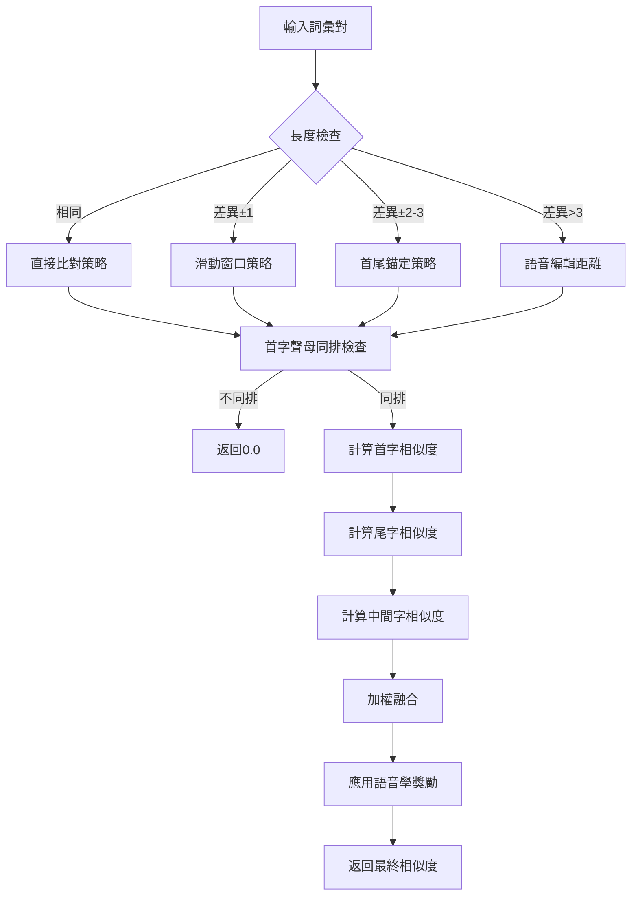

# TWGY_V3 算法實現細節

## 1. 核心算法實現

### 1.1 首尾字優先比對算法

#### 1.1.1 算法流程圖



#### 1.1.2 核心實現

```python
class FirstLastPriorityComparator:
    """首尾字優先比對器"""
    
    def __init__(self, phonetic_classifier: PhoneticClassifier):
        self.classifier = phonetic_classifier
        self.weights = {
            'first_char': 0.4,
            'last_char': 0.4,
            'middle_chars': 0.2
        }
    
    def compare(self, word1: str, word2: str) -> float:
        """主比對函數"""
        if not word1 or not word2:
            return 0.0
        
        if word1 == word2:
            return 1.0
        
        # 第一層：快速篩選
        if not self._quick_filter(word1, word2):
            return 0.0
        
        # 第二層：詳細計算
        return self._detailed_calculation(word1, word2)
    
    def _quick_filter(self, word1: str, word2: str) -> bool:
        """快速篩選：首字聲母同排檢查"""
        first1_row = self.classifier.get_initial_row(word1[0])
        first2_row = self.classifier.get_initial_row(word2[0])
        return first1_row == first2_row
    
    def _detailed_calculation(self, word1: str, word2: str) -> float:
        """詳細相似度計算"""
        # 首字相似度
        first_sim = self.classifier.calculate_char_similarity(
            word1[0], word2[0]
        )
        
        # 尾字相似度
        last_sim = self.classifier.calculate_char_similarity(
            word1[-1], word2[-1]
        )
        
        # 中間字相似度
        middle_sim = self._calculate_middle_similarity(word1, word2)
        
        # 加權融合
        weighted_sim = (
            first_sim * self.weights['first_char'] +
            last_sim * self.weights['last_char'] +
            middle_sim * self.weights['middle_chars']
        )
        
        return min(1.0, weighted_sim)
```

### 1.2 語音學表格化分類實現

#### 1.2.1 分類表格數據結構

```python
from dataclasses import dataclass
from typing import Dict, List, Set, Optional

@dataclass
class PhoneticRow:
    """語音學分類行"""
    name: str
    phonemes: List[str]
    pinyin: List[str]
    similarity_within_row: float
    features: Dict[str, any]

@dataclass
class CrossRowSimilarity:
    """跨排相似度規則"""
    rows: List[str]
    similarity: float
    description: str
    pairs: List[Tuple[str, str]]

class PhoneticClassificationTable:
    """語音學分類表格"""
    
    def __init__(self):
        self.initial_rows = self._load_initial_classification()
        self.final_groups = self._load_final_classification()
        self.cross_similarities = self._load_cross_similarities()
        self.phoneme_to_row = self._build_phoneme_index()
```

這份文檔提供了 TWGY_V3 系統的詳細算法實現基礎框架。