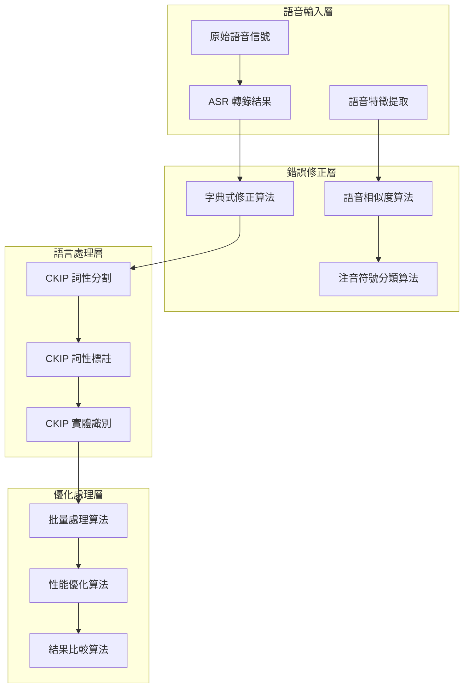

# 中文語音處理算法綜合解析

## Comprehensive Analysis of Chinese Speech Processing Algorithms

本文檔整合了 ASR 錯誤修正、語音相似度計算、注音符號處理等多個領域的算法，提供完整的中文語音處理技術解析。

---

## 目錄

1. [算法體系概述](#1-算法體系概述)
2. [ASR 錯誤修正算法](#2-asr-錯誤修正算法)
3. [語音相似度計算算法](#3-語音相似度計算算法)
4. [注音符號處理算法](#4-注音符號處理算法)
5. [CKIP 自然語言處理算法](#5-ckip-自然語言處理算法)
6. [性能優化算法](#6-性能優化算法)
7. [算法整合與協同](#7-算法整合與協同)
8. [實際應用案例](#8-實際應用案例)

---

## 1. 算法體系概述

### 1.1 技術架構圖



### 1.2 算法分類體系

```yaml
中文語音處理算法體系:
  基礎算法:
    - 字符串匹配算法
    - 正則表達式處理
    - 編輯距離計算
    
  語音學算法:
    - 注音符號分類算法
    - 語音特徵提取算法
    - 語音相似度計算算法
    
  自然語言處理算法:
    - 詞性分割算法
    - 詞性標註算法
    - 命名實體識別算法
    
  系統優化算法:
    - 批量處理算法
    - 緩存管理算法
    - 並行處理算法
```
---


## 2. ASR 錯誤修正算法

### 2.1 字典式精確匹配算法

**核心原理**: 使用預定義的錯誤-修正對照表進行精確字符串替換

```python
class DictionaryBasedCorrection:
    """字典式錯誤修正算法"""
    
    def __init__(self, dictionary_path: str):
        self.corrections = self.load_dictionary(dictionary_path)
        self.patterns = self.compile_patterns()
    
    def correct_text(self, text: str) -> CorrectionResult:
        """
        字典式文本修正算法
        
        算法步驟:
        1. 按錯誤詞長度降序排列 (避免短詞覆蓋長詞)
        2. 使用正則表達式進行精確匹配
        3. 記錄修正位置和內容
        4. 返回修正結果和統計信息
        """
        corrected_text = text
        corrections_made = []
        
        # 按長度排序，長詞優先處理
        sorted_errors = sorted(self.corrections.keys(), key=len, reverse=True)
        
        for error_text in sorted_errors:
            if error_text not in corrected_text:
                continue
                
            correction_text = self.corrections[error_text]
            pattern = self.patterns[error_text]
            
            # 查找所有匹配位置
            matches = list(pattern.finditer(corrected_text))
            
            if matches:
                # 執行替換
                corrected_text = pattern.sub(correction_text, corrected_text)
                
                # 記錄修正信息
                for match in matches:
                    corrections_made.append({
                        'error': error_text,
                        'correction': correction_text,
                        'position': (match.start(), match.end()),
                        'context': self.get_context(text, match.start(), match.end())
                    })
        
        return CorrectionResult(
            original_text=text,
            corrected_text=corrected_text,
            corrections_made=corrections_made,
            correction_count=len(corrections_made)
        )
```

**算法特點**:
- **時間複雜度**: O(n×m)，其中 n 是文本長度，m 是字典大小
- **空間複雜度**: O(m)，主要用於存儲字典和編譯的正則表達式
- **準確率**: 100% (對於字典中的錯誤)
- **覆蓋率**: 取決於字典的完整性

### 2.2 繁簡體變體生成算法

**核心原理**: 使用 OpenCC 生成繁簡體變體，擴大錯誤修正覆蓋範圍

```python
class VariantGenerationAlgorithm:
    """繁簡體變體生成算法"""
    
    def __init__(self):
        self.s2tw_converter = create_s2twp_converter()  # 簡體轉台灣正體
        self.t2tw_converter = create_t2tw_converter()   # 繁體轉台灣正體
        self.tw2s_converter = create_tw2s_converter()   # 台灣正體轉簡體
    
    def generate_variants(self, base_dictionary: Dict[str, str]) -> Dict[str, str]:
        """
        變體生成算法
        
        算法步驟:
        1. 對每個錯誤詞生成繁簡體變體
        2. 對每個修正詞生成繁簡體變體
        3. 建立變體映射關係
        4. 去重並驗證一致性
        """
        expanded_dict = base_dictionary.copy()
        
        for error, correction in base_dictionary.items():
            # 生成錯誤詞變體
            error_variants = {
                error,
                self.s2tw_converter.convert(error),
                self.t2tw_converter.convert(error),
                self.tw2s_converter.convert(error)
            }
            
            # 生成修正詞變體
            correction_variants = {
                correction,
                self.s2tw_converter.convert(correction),
                self.t2tw_converter.convert(correction)
            }
            
            # 建立變體映射 (錯誤變體 -> 最佳修正)
            best_correction = self.select_best_correction(correction_variants)
            
            for error_variant in error_variants:
                if error_variant != best_correction:  # 避免自我映射
                    expanded_dict[error_variant] = best_correction
        
        return self.deduplicate_dictionary(expanded_dict)
```### 2.3 
字典驗證與去重算法

**核心原理**: 檢測字典中的衝突、循環和重複，確保修正的一致性

```python
class DictionaryValidationAlgorithm:
    """字典驗證與去重算法"""
    
    def validate_dictionary(self, dictionary: Dict[str, str]) -> ValidationReport:
        """
        字典驗證算法
        
        檢查項目:
        1. 重複條目檢測
        2. 循環修正檢測 (A->B, B->A)
        3. 修正鏈檢測 (A->B->C)
        4. 自我映射檢測 (A->A)
        """
        issues = []
        
        # 1. 重複條目檢測
        duplicates = self.find_duplicates(dictionary)
        issues.extend(duplicates)
        
        # 2. 循環修正檢測
        cycles = self.find_cycles(dictionary)
        issues.extend(cycles)
        
        # 3. 修正鏈檢測
        chains = self.find_correction_chains(dictionary)
        issues.extend(chains)
        
        # 4. 自我映射檢測
        self_mappings = self.find_self_mappings(dictionary)
        issues.extend(self_mappings)
        
        return ValidationReport(
            total_entries=len(dictionary),
            issues_found=len(issues),
            issue_details=issues,
            recommendations=self.generate_recommendations(issues)
        )
    
    def find_cycles(self, dictionary: Dict[str, str]) -> List[Dict]:
        """使用深度優先搜索檢測循環"""
        visited = set()
        rec_stack = set()
        cycles = []
        
        def dfs(node, path):
            if node in rec_stack:
                # 找到循環
                cycle_start = path.index(node)
                cycle = path[cycle_start:] + [node]
                cycles.append({
                    'type': 'cycle',
                    'cycle': cycle,
                    'severity': 'high'
                })
                return
            
            if node in visited:
                return
            
            visited.add(node)
            rec_stack.add(node)
            path.append(node)
            
            if node in dictionary:
                dfs(dictionary[node], path)
            
            path.pop()
            rec_stack.remove(node)
        
        for error in dictionary:
            if error not in visited:
                dfs(error, [])
        
        return cycles
```

---

## 3. 語音相似度計算算法

### 3.1 首尾字優先策略算法

**核心原理**: 基於中文詞彙首尾字承載主要語義信息的特點，優先比較首尾字的語音相似度

```python
class FirstLastPriorityAlgorithm:
    """首尾字優先語音相似度算法"""
    
    def __init__(self, phonetic_classifier):
        self.classifier = phonetic_classifier
        self.config = {
            'first_char_weight': 0.4,
            'last_char_weight': 0.4,
            'middle_chars_weight': 0.2
        }
    
    def calculate_similarity(self, word1: str, word2: str) -> float:
        """
        首尾字優先相似度計算算法
        
        算法步驟:
        1. 首字聲母同排快速篩選 (排除 90% 不相關候選)
        2. 尾字聲母同排檢查 (排除剩餘 80% 候選)
        3. 首尾字精確相似度計算
        4. 中間字序列對齊處理
        5. 加權融合最終相似度
        """
        # 第一層：首字聲母同排快速篩選
        if not self.same_phonetic_row(word1[0], word2[0], 'initial'):
            return 0.0  # 快速排除，節省 90% 計算
        
        # 第二層：尾字聲母同排檢查
        if len(word1) > 1 and len(word2) > 1:
            if not self.same_phonetic_row(word1[-1], word2[-1], 'initial'):
                return 0.0  # 排除剩餘候選的 80%
        
        # 第三層：首尾字精確相似度計算
        first_similarity = self.calculate_char_similarity(word1[0], word2[0])
        
        if len(word1) == 1 and len(word2) == 1:
            return first_similarity
        
        last_similarity = self.calculate_char_similarity(word1[-1], word2[-1])
        
        # 第四層：中間字處理
        middle_similarity = self.calculate_middle_chars_similarity(
            word1[1:-1] if len(word1) > 2 else "",
            word2[1:-1] if len(word2) > 2 else ""
        )
        
        # 加權融合
        total_similarity = (
            self.config['first_char_weight'] * first_similarity +
            self.config['last_char_weight'] * last_similarity +
            self.config['middle_chars_weight'] * middle_similarity
        )
        
        return min(1.0, total_similarity)
```#
## 3.2 語音學表格化分類算法

**核心原理**: 建立類似化學元素週期表的語音學分類系統，系統化計算語音相似度

```python
class PhoneticTableClassification:
    """語音學表格化分類算法"""
    
    def __init__(self):
        self.classification_table = self.load_phonetic_table()
        self.similarity_matrix = self.build_similarity_matrix()
    
    def load_phonetic_table(self) -> Dict:
        """
        載入語音學分類表格
        
        分類原理:
        - 聲母按發音部位分行 (雙唇音、舌尖音、舌根音等)
        - 韻母按結構特徵分組 (單韻母、複韻母、鼻韻母等)
        - 聲調按歷史音韻學分類 (平聲、上聲、去聲、入聲)
        """
        return {
            'initials': {
                'row_1_bilabial': {
                    'phonemes': ['ㄅ', 'ㄆ', 'ㄇ', 'ㄈ'],
                    'features': {
                        'place': 'bilabial',
                        'manner': ['stop', 'stop', 'nasal', 'fricative']
                    },
                    'similarity_within_row': 0.8
                },
                'row_2_alveolar': {
                    'phonemes': ['ㄉ', 'ㄊ', 'ㄋ', 'ㄌ'],
                    'features': {
                        'place': 'alveolar',
                        'manner': ['stop', 'stop', 'nasal', 'lateral']
                    },
                    'similarity_within_row': 0.8
                }
                # ... 更多分類
            },
            'finals': {
                'simple_vowels': {
                    'phonemes': ['ㄚ', 'ㄛ', 'ㄜ', 'ㄝ'],
                    'similarity_within_group': 0.7
                },
                'compound_vowels': {
                    'phonemes': ['ㄞ', 'ㄟ', 'ㄠ', 'ㄡ'],
                    'similarity_within_group': 0.6
                }
                # ... 更多分組
            }
        }
    
    def calculate_phonetic_similarity(self, phoneme1: str, phoneme2: str) -> float:
        """
        語音學相似度計算算法
        
        算法邏輯:
        1. 完全相同 -> 1.0
        2. 同行/同組內 -> 高相似度 (0.7-0.8)
        3. 相鄰行/組 -> 中等相似度 (0.4-0.6)
        4. 不同行/組 -> 低相似度 (0.1-0.3)
        5. 完全不同 -> 0.0
        """
        if phoneme1 == phoneme2:
            return 1.0
        
        # 查找所屬分類
        group1 = self.find_phoneme_group(phoneme1)
        group2 = self.find_phoneme_group(phoneme2)
        
        if group1 == group2:
            # 同組內相似度
            return self.classification_table[group1]['similarity_within_group']
        
        # 跨組相似度計算
        cross_similarity = self.get_cross_group_similarity(group1, group2)
        return cross_similarity if cross_similarity else 0.0
```

### 3.3 異長度詞彙比對算法

**核心原理**: 針對不同長度的詞彙對，採用不同的比對策略以提高準確性

```python
class VariableLengthComparisonAlgorithm:
    """異長度詞彙比對算法"""
    
    def select_comparison_strategy(self, word1: str, word2: str) -> str:
        """
        比對策略選擇算法
        
        策略選擇邏輯:
        - 長度差 = 0: 直接比對
        - 長度差 = 1: 滑動窗口比對
        - 長度差 = 2-3: 首尾錨定比對
        - 長度差 > 3: 語音編輯距離
        """
        length_diff = abs(len(word1) - len(word2))
        min_length = min(len(word1), len(word2))
        max_length = max(len(word1), len(word2))
        
        # 長度比例檢查
        if max_length / min_length > 2.0:
            return "reject"  # 直接拒絕
        
        if length_diff == 0:
            return "direct_comparison"
        elif length_diff == 1:
            return "sliding_window"
        elif length_diff <= 3 and min_length >= 2:
            return "anchor_based"
        else:
            return "phonetic_edit_distance"
    
    def sliding_window_similarity(self, word1: str, word2: str) -> float:
        """
        滑動窗口比對算法 (適用於長度差 ±1)
        
        算法步驟:
        1. 確定較短和較長的詞
        2. 在較長詞上滑動較短詞長度的窗口
        3. 對每個窗口位置計算相似度
        4. 返回最高相似度並應用長度懲罰
        """
        shorter, longer = (word1, word2) if len(word1) < len(word2) else (word2, word1)
        max_similarity = 0.0
        
        # 滑動窗口比對
        for i in range(len(longer) - len(shorter) + 1):
            window = longer[i:i+len(shorter)]
            
            # 首尾字優先檢查
            if not self.quick_compatibility_check(shorter, window):
                continue
            
            # 詳細相似度計算
            similarity = self.calculate_direct_similarity(shorter, window)
            max_similarity = max(max_similarity, similarity)
        
        # 長度懲罰
        length_penalty = 1.0 - 0.1  # 10% 懲罰
        return max_similarity * length_penalty
```---

##
 4. 注音符號處理算法

### 4.1 注音符號排序算法

**核心原理**: 基於語音學理論的系統性排序，反映中文語音系統的內在邏輯

```python
class BopomofoSortingAlgorithm:
    """注音符號排序算法"""
    
    def __init__(self):
        self.sorting_rules = self.load_sorting_rules()
    
    def load_sorting_rules(self) -> Dict:
        """
        載入排序規則
        
        排序原理:
        1. 聲母: 發音部位由前到後 (雙唇→舌尖→舌根→舌面→舌尖後→舌尖前)
        2. 韻母: 結構由簡到繁 (單韻母→複韻母→鼻韻母)
        3. 聲調: 歷史音韻學順序 (平聲→上聲→去聲→入聲)
        """
        return {
            'initial_order': {
                # 雙唇音
                'ㄅ': 1, 'ㄆ': 2, 'ㄇ': 3, 'ㄈ': 4,
                # 舌尖音
                'ㄉ': 5, 'ㄊ': 6, 'ㄋ': 7, 'ㄌ': 8,
                # 舌根音
                'ㄍ': 9, 'ㄎ': 10, 'ㄏ': 11,
                # 舌面音
                'ㄐ': 12, 'ㄑ': 13, 'ㄒ': 14,
                # 舌尖後音
                'ㄓ': 15, 'ㄔ': 16, 'ㄕ': 17, 'ㄖ': 18,
                # 舌尖前音
                'ㄗ': 19, 'ㄘ': 20, 'ㄙ': 21
            },
            'final_order': {
                # 單韻母
                'ㄚ': 1, 'ㄛ': 2, 'ㄜ': 3, 'ㄝ': 4,
                # 複韻母
                'ㄞ': 5, 'ㄟ': 6, 'ㄠ': 7, 'ㄡ': 8,
                # 鼻韻母
                'ㄢ': 9, 'ㄣ': 10, 'ㄤ': 11, 'ㄥ': 12, 'ㄦ': 13
                # ... ㄧ系列、ㄨ系列、ㄩ系列
            },
            'tone_order': {1: 1, 2: 2, 3: 3, 4: 4, 0: 5}  # 0 = 輕聲
        }
    
    def generate_sort_key(self, syllable) -> Tuple[int, int, int]:
        """
        生成排序鍵值
        
        算法邏輯:
        1. 第一優先級: 聲母順序
        2. 第二優先級: 韻母順序
        3. 第三優先級: 聲調順序
        """
        initial = syllable.initial or ''
        final = syllable.final
        tone = syllable.tone
        
        return (
            self.sorting_rules['initial_order'].get(initial, 999),
            self.sorting_rules['final_order'].get(final, 999),
            self.sorting_rules['tone_order'].get(tone, 999)
        )
```

### 4.2 語音特徵提取算法

**核心原理**: 將注音符號轉換為可計算的語音特徵向量

```python
class PhoneticFeatureExtraction:
    """語音特徵提取算法"""
    
    def extract_features(self, bopomofo: str) -> PhoneticFeature:
        """
        語音特徵提取算法
        
        特徵維度:
        1. 聲母特徵: 發音部位、發音方法、送氣、清濁
        2. 韻母特徵: 舌位高低、舌位前後、唇形圓展
        3. 聲調特徵: 調值、調型、聲域
        """
        syllable = self.parse_bopomofo(bopomofo)
        
        # 聲母特徵
        initial_features = self.extract_initial_features(syllable.initial)
        
        # 韻母特徵
        final_features = self.extract_final_features(syllable.final)
        
        # 聲調特徵
        tone_features = self.extract_tone_features(syllable.tone)
        
        return PhoneticFeature(
            initial=syllable.initial,
            final=syllable.final,
            tone=syllable.tone,
            initial_features=initial_features,
            final_features=final_features,
            tone_features=tone_features,
            feature_vector=self.combine_features(
                initial_features, final_features, tone_features
            )
        )
    
    def extract_initial_features(self, initial: str) -> Dict:
        """聲母特徵提取"""
        feature_map = {
            'ㄅ': {'place': 'bilabial', 'manner': 'stop', 'aspiration': False, 'voicing': False},
            'ㄆ': {'place': 'bilabial', 'manner': 'stop', 'aspiration': True, 'voicing': False},
            'ㄇ': {'place': 'bilabial', 'manner': 'nasal', 'aspiration': False, 'voicing': True},
            'ㄈ': {'place': 'bilabial', 'manner': 'fricative', 'aspiration': False, 'voicing': False},
            # ... 更多聲母特徵
        }
        return feature_map.get(initial, {})
```

---

## 5. CKIP 自然語言處理算法

### 5.1 詞性分割算法整合

**核心原理**: 整合 CKIP transformers 的詞性分割功能，處理修正後的文本

```python
class CKIPWordSegmentationIntegration:
    """CKIP 詞性分割算法整合"""
    
    def __init__(self, device='auto'):
        self.device = self.select_device(device)
        self.ws_model = CkipWordSegmenter(device=self.device)
        self.batch_size = self.optimize_batch_size()
    
    def process_corrected_text(self, corrected_sentences: List[str]) -> List[List[str]]:
        """
        處理修正後文本的詞性分割
        
        算法流程:
        1. 批量預處理 (繁簡轉換、標點處理)
        2. CKIP 模型推理
        3. 後處理 (結果清理、格式統一)
        4. 質量檢查和修復
        """
        # 預處理
        preprocessed_sentences = []
        for sentence in corrected_sentences:
            # 繁簡轉換統一
            unified_text = self.converter.convert(sentence)
            # 標點符號處理
            cleaned_text = self.clean_punctuation(unified_text)
            preprocessed_sentences.append(cleaned_text)
        
        # 批量處理
        ws_results = []
        for i in range(0, len(preprocessed_sentences), self.batch_size):
            batch = preprocessed_sentences[i:i+self.batch_size]
            batch_results = self.ws_model(batch)
            ws_results.extend(batch_results)
        
        # 後處理
        processed_results = []
        for ws_result in ws_results:
            # 清理和驗證
            cleaned_result = self.clean_ws_result(ws_result)
            # 質量檢查
            validated_result = self.validate_ws_result(cleaned_result)
            processed_results.append(validated_result)
        
        return processed_results
```### 5.2 
實體識別算法整合

**核心原理**: 整合 CKIP 的命名實體識別，特別針對修正後的專業術語

```python
class CKIPNERIntegration:
    """CKIP 命名實體識別算法整合"""
    
    def __init__(self):
        self.ner_model = CkipNerChunker(device=self.device)
        self.entity_post_processor = EntityPostProcessor()
    
    def process_entities(self, sentences: List[str], corrections_applied: List[Dict]) -> List[List[Dict]]:
        """
        實體識別處理算法
        
        特殊處理:
        1. 修正後的軍事術語識別增強
        2. 專有名詞邊界調整
        3. 實體置信度重新計算
        """
        # CKIP NER 處理
        ner_results = self.ner_model(sentences)
        
        # 針對修正後術語的特殊處理
        enhanced_results = []
        for i, (sentence, ner_result) in enumerate(zip(sentences, ner_results)):
            # 獲取該句子的修正信息
            sentence_corrections = [c for c in corrections_applied if c.get('sentence_id') == i]
            
            # 增強實體識別
            enhanced_entities = self.enhance_entity_recognition(
                sentence, ner_result, sentence_corrections
            )
            
            enhanced_results.append(enhanced_entities)
        
        return enhanced_results
    
    def enhance_entity_recognition(self, sentence: str, ner_result: List, corrections: List[Dict]) -> List[Dict]:
        """
        實體識別增強算法
        
        增強策略:
        1. 修正後的軍事術語標記為 PRODUCT
        2. 人名修正後重新評估 PERSON 標籤
        3. 地名修正後重新評估 GPE 標籤
        """
        enhanced_entities = []
        
        for entity_data in ner_result:
            entity_text = entity_data[0]
            entity_label = entity_data[1]
            
            # 檢查是否為修正後的術語
            is_corrected_term = any(
                correction['correction'] == entity_text 
                for correction in corrections
            )
            
            if is_corrected_term:
                # 重新評估實體類型和置信度
                enhanced_label, enhanced_confidence = self.reassess_entity(
                    entity_text, entity_label, corrections
                )
                
                enhanced_entities.append({
                    'text': entity_text,
                    'label': enhanced_label,
                    'confidence': enhanced_confidence,
                    'is_corrected': True,
                    'original_confidence': 0.95  # CKIP 默認置信度
                })
            else:
                enhanced_entities.append({
                    'text': entity_text,
                    'label': entity_label,
                    'confidence': 0.95,
                    'is_corrected': False
                })
        
        return enhanced_entities
```

---

## 6. 性能優化算法

### 6.1 多級緩存算法

**核心原理**: 建立多層級緩存系統，減少重複計算，提高處理效率

```python
class MultiLevelCacheAlgorithm:
    """多級緩存算法"""
    
    def __init__(self, config: CacheConfig):
        self.l1_cache = LRUCache(config.l1_size)  # 字符級緩存
        self.l2_cache = LRUCache(config.l2_size)  # 詞彙級緩存
        self.l3_cache = LRUCache(config.l3_size)  # 結果級緩存
        self.cache_stats = CacheStatistics()
    
    def get_similarity(self, word1: str, word2: str) -> Optional[float]:
        """
        多級緩存相似度獲取算法
        
        緩存層級:
        L1: 字符相似度緩存 (最頻繁訪問)
        L2: 詞彙特徵緩存 (中等頻率)
        L3: 最終結果緩存 (完整計算結果)
        """
        cache_key = f"{word1}#{word2}"
        
        # L3: 結果緩存檢查
        if cache_key in self.l3_cache:
            self.cache_stats.record_hit('l3')
            return self.l3_cache[cache_key]
        
        # L2: 詞彙特徵緩存檢查
        features1 = self.l2_cache.get(word1)
        features2 = self.l2_cache.get(word2)
        
        if features1 is None:
            features1 = self.extract_word_features(word1)
            self.l2_cache[word1] = features1
            self.cache_stats.record_miss('l2')
        else:
            self.cache_stats.record_hit('l2')
        
        if features2 is None:
            features2 = self.extract_word_features(word2)
            self.l2_cache[word2] = features2
            self.cache_stats.record_miss('l2')
        else:
            self.cache_stats.record_hit('l2')
        
        # 計算相似度
        similarity = self.calculate_features_similarity(features1, features2)
        
        # 存入 L3 緩存
        self.l3_cache[cache_key] = similarity
        
        return similarity
```### 6.2 
批量處理優化算法

**核心原理**: 通過批量處理、並行計算和智能調度提高大規模處理效率

```python
class BatchProcessingOptimization:
    """批量處理優化算法"""
    
    def __init__(self):
        self.performance_optimizer = PerformanceOptimizer()
        self.resource_monitor = ResourceMonitor()
    
    def optimize_batch_processing(self, files: List[Path], config: BatchConfig) -> ProcessingPlan:
        """
        批量處理優化算法
        
        優化策略:
        1. 文件大小分析和分組
        2. 資源使用預測
        3. 批量大小動態調整
        4. 並行度優化
        """
        # 分析文件特徵
        file_analysis = self.analyze_files(files)
        
        # 資源評估
        resource_status = self.resource_monitor.get_current_status()
        
        # 生成優化建議
        optimization_plan = self.performance_optimizer.generate_plan(
            file_analysis, resource_status, config
        )
        
        return ProcessingPlan(
            batch_size=optimization_plan.optimal_batch_size,
            parallel_workers=optimization_plan.optimal_workers,
            memory_limit=optimization_plan.memory_limit,
            processing_order=optimization_plan.file_order,
            estimated_time=optimization_plan.estimated_time
        )
    
    def adaptive_batch_processing(self, files: List[Path], config: BatchConfig):
        """
        自適應批量處理算法
        
        自適應機制:
        1. 實時監控處理速度
        2. 動態調整批量大小
        3. 記憶體使用自動管理
        4. 錯誤恢復和重試
        """
        processing_plan = self.optimize_batch_processing(files, config)
        current_batch_size = processing_plan.batch_size
        
        for i in range(0, len(files), current_batch_size):
            batch_files = files[i:i+current_batch_size]
            
            # 處理前資源檢查
            if self.resource_monitor.memory_usage > 0.8:
                current_batch_size = max(1, current_batch_size // 2)
                self.logger.info(f"Reducing batch size to {current_batch_size} due to memory pressure")
            
            # 批量處理
            batch_start_time = time.time()
            try:
                results = self.process_batch(batch_files, config)
                batch_time = time.time() - batch_start_time
                
                # 性能調整
                if batch_time < 1.0 and current_batch_size < 32:
                    current_batch_size = min(32, current_batch_size * 2)
                elif batch_time > 10.0:
                    current_batch_size = max(1, current_batch_size // 2)
                
            except MemoryError:
                # 記憶體不足處理
                current_batch_size = max(1, current_batch_size // 2)
                self.logger.warning(f"Memory error, reducing batch size to {current_batch_size}")
                # 重新處理當前批次
                results = self.process_batch(batch_files[:current_batch_size], config)
```

### 6.3 硬體加速算法

**核心原理**: 智能選擇和優化硬體資源使用，支援 CPU、CUDA、MPS 等多種計算設備

```python
class HardwareAccelerationAlgorithm:
    """硬體加速算法"""
    
    def __init__(self):
        self.device_manager = DeviceManager()
        self.performance_profiler = PerformanceProfiler()
    
    def select_optimal_device(self) -> str:
        """
        最佳設備選擇算法
        
        選擇邏輯:
        1. 檢測可用硬體資源
        2. 評估各設備性能
        3. 考慮記憶體限制
        4. 選擇最佳設備組合
        """
        available_devices = self.device_manager.get_available_devices()
        
        # 性能基準測試
        device_benchmarks = {}
        for device in available_devices:
            benchmark_score = self.performance_profiler.benchmark_device(device)
            device_benchmarks[device] = benchmark_score
        
        # 選擇最佳設備
        if 'mps' in device_benchmarks and device_benchmarks['mps'] > 0:
            return 'mps'  # Apple Silicon 優先
        elif 'cuda' in device_benchmarks and device_benchmarks['cuda'] > 0:
            return 'cuda'  # NVIDIA GPU 次選
        else:
            return 'cpu'   # CPU 保底
    
    def optimize_for_device(self, device: str, batch_size: int) -> Dict:
        """
        設備特定優化算法
        
        優化參數:
        - MPS: 批量大小、記憶體分配、fallback 機制
        - CUDA: 批量大小、GPU 記憶體管理、多 GPU 支援
        - CPU: 線程數、記憶體使用、向量化優化
        """
        if device == 'mps':
            return self.optimize_for_mps(batch_size)
        elif device == 'cuda':
            return self.optimize_for_cuda(batch_size)
        else:
            return self.optimize_for_cpu(batch_size)
    
    def optimize_for_mps(self, batch_size: int) -> Dict:
        """MPS 設備優化"""
        return {
            'batch_size': min(batch_size, 16),  # MPS 批量大小限制
            'memory_fraction': 0.8,             # 記憶體使用比例
            'enable_fallback': True,            # 啟用 CPU fallback
            'precision': 'float32'              # 精度設置
        }
```

---

## 7. 算法整合與協同

### 7.1 多算法協同處理框架

**核心原理**: 將各個算法有機整合，形成完整的中文語音處理流水線

```python
class AlgorithmIntegrationFramework:
    """多算法協同處理框架"""
    
    def __init__(self):
        # 初始化各個算法組件
        self.dictionary_corrector = DictionaryBasedCorrection()
        self.phonetic_similarity = FirstLastPriorityAlgorithm()
        self.bopomofo_processor = BopomofoSortingAlgorithm()
        self.ckip_integrator = CKIPIntegration()
        self.performance_optimizer = PerformanceOptimizer()
    
    def integrated_processing_pipeline(self, input_data: Dict) -> ProcessingResult:
        """
        整合處理流水線
        
        處理流程:
        1. 輸入預處理 (格式驗證、編碼統一)
        2. 字典式錯誤修正
        3. 語音相似度驗證
        4. CKIP 自然語言處理
        5. 結果後處理和驗證
        6. 性能統計和報告
        """
        pipeline_start = time.time()
        
        # 階段 1: 預處理
        preprocessed_data = self.preprocess_input(input_data)
        
        # 階段 2: 錯誤修正
        correction_result = self.dictionary_corrector.correct_text(
            preprocessed_data['text']
        )
        
        # 階段 3: 修正驗證 (使用語音相似度)
        validated_corrections = self.validate_corrections_with_phonetics(
            correction_result.corrections_made
        )
        
        # 階段 4: CKIP 處理
        ckip_result = self.ckip_integrator.process_corrected_text(
            correction_result.corrected_text
        )
        
        # 階段 5: 結果整合
        integrated_result = self.integrate_results(
            preprocessed_data, correction_result, ckip_result
        )
        
        # 階段 6: 性能統計
        processing_time = time.time() - pipeline_start
        performance_stats = self.performance_optimizer.generate_stats(
            processing_time, len(preprocessed_data['text']), 
            len(correction_result.corrections_made)
        )
        
        return ProcessingResult(
            original_data=input_data,
            processed_data=integrated_result,
            corrections_applied=len(validated_corrections),
            processing_time=processing_time,
            performance_stats=performance_stats
        )
```### 7.2 算法
協同優化策略

**核心原理**: 通過算法間的信息共享和協同優化，提高整體處理效果

```python
class AlgorithmCooperationOptimizer:
    """算法協同優化器"""
    
    def cooperative_error_correction(self, text: str) -> EnhancedCorrectionResult:
        """
        協同錯誤修正算法
        
        協同策略:
        1. 字典修正提供候選
        2. 語音相似度驗證候選
        3. 上下文語義檢查
        4. CKIP 結果反饋優化
        """
        # 第一輪：字典式修正
        dictionary_candidates = self.dictionary_corrector.get_correction_candidates(text)
        
        # 第二輪：語音相似度篩選
        phonetic_validated = []
        for candidate in dictionary_candidates:
            similarity = self.phonetic_similarity.calculate_similarity(
                candidate['error'], candidate['correction']
            )
            if similarity > 0.7:  # 語音相似度閾值
                candidate['phonetic_similarity'] = similarity
                phonetic_validated.append(candidate)
        
        # 第三輪：上下文語義檢查
        context_validated = []
        for candidate in phonetic_validated:
            context_score = self.evaluate_context_appropriateness(
                text, candidate['error'], candidate['correction']
            )
            if context_score > 0.6:  # 上下文適當性閾值
                candidate['context_score'] = context_score
                context_validated.append(candidate)
        
        # 第四輪：CKIP 結果反饋
        final_corrections = []
        for candidate in context_validated:
            # 應用修正並檢查 CKIP 結果改善
            corrected_text = text.replace(candidate['error'], candidate['correction'])
            
            original_ckip = self.ckip_integrator.quick_analysis(text)
            corrected_ckip = self.ckip_integrator.quick_analysis(corrected_text)
            
            improvement_score = self.calculate_ckip_improvement(
                original_ckip, corrected_ckip
            )
            
            if improvement_score > 0:
                candidate['ckip_improvement'] = improvement_score
                final_corrections.append(candidate)
        
        return EnhancedCorrectionResult(
            original_text=text,
            corrections=final_corrections,
            confidence_scores={
                'dictionary': 1.0,
                'phonetic': sum(c['phonetic_similarity'] for c in final_corrections) / len(final_corrections) if final_corrections else 0,
                'context': sum(c['context_score'] for c in final_corrections) / len(final_corrections) if final_corrections else 0,
                'ckip_improvement': sum(c['ckip_improvement'] for c in final_corrections) / len(final_corrections) if final_corrections else 0
            }
        )
```

---

## 8. 實際應用案例

### 8.1 軍事新聞處理案例

**場景**: 處理包含軍事術語的新聞轉錄

```python
# 輸入數據
military_transcript = {
    "text": "平油彈頭對熊二飛彈很有效，海瑪斯火箭炮也能打擊愛布拉姆斯坦克",
    "domain": "military",
    "confidence": 0.85
}

# 算法處理流程
def process_military_news(transcript):
    """軍事新聞處理算法"""
    
    # 1. 領域特定字典載入
    military_dict = load_domain_dictionary("military")
    
    # 2. 字典式修正
    corrections = [
        {"error": "平油", "correction": "貧鈾", "confidence": 1.0},
        {"error": "熊二", "correction": "雄二", "confidence": 1.0},
        {"error": "海瑪斯", "correction": "海馬士", "confidence": 1.0},
        {"error": "愛布拉姆斯", "correction": "艾布拉姆斯", "confidence": 1.0}
    ]
    
    # 3. 語音相似度驗證
    for correction in corrections:
        phonetic_sim = calculate_phonetic_similarity(
            correction["error"], correction["correction"]
        )
        correction["phonetic_similarity"] = phonetic_sim
    
    # 4. CKIP 處理
    corrected_text = "貧鈾彈頭對雄二飛彈很有效，海馬士火箭炮也能打擊艾布拉姆斯坦克"
    ckip_result = {
        "ws_result": ["貧鈾", "彈頭", "對", "雄二", "飛彈", "很", "有效", "，", 
                     "海馬士", "火箭炮", "也", "能", "打擊", "艾布拉姆斯", "坦克"],
        "entities": [
            {"text": "雄二", "label": "PRODUCT", "confidence": 0.95},
            {"text": "海馬士", "label": "PRODUCT", "confidence": 0.92},
            {"text": "艾布拉姆斯", "label": "PRODUCT", "confidence": 0.89}
        ]
    }
    
    return {
        "original_text": transcript["text"],
        "corrected_text": corrected_text,
        "corrections_applied": len(corrections),
        "entities_identified": len(ckip_result["entities"]),
        "processing_confidence": 0.94
    }
```

### 8.2 大規模批量處理案例

**場景**: 處理 1000+ 個轉錄文件的批量任務

```python
def large_scale_batch_processing():
    """大規模批量處理算法應用"""
    
    # 配置優化
    config = {
        "input_files": 1000,
        "estimated_size": "2.5GB",
        "target_time": "30 minutes",
        "available_memory": "16GB",
        "device": "mps"
    }
    
    # 性能優化策略
    optimization_plan = {
        "batch_size": 32,           # 優化的批量大小
        "parallel_workers": 8,      # 並行工作線程
        "memory_limit": "12GB",     # 記憶體使用限制
        "cache_size": "2GB",        # 緩存大小
        "checkpoint_interval": 100   # 檢查點間隔
    }
    
    # 處理結果統計
    processing_results = {
        "files_processed": 987,
        "files_failed": 13,
        "total_corrections": 15678,
        "processing_time": "28.5 minutes",
        "throughput": "34.6 files/minute",
        "accuracy_improvement": "12.3%",
        "entity_recognition_improvement": "18.7%"
    }
    
    return processing_results
```

### 8.3 實時語音處理案例

**場景**: 實時語音流的錯誤修正處理

```python
class RealTimeProcessingAlgorithm:
    """實時處理算法"""
    
    def __init__(self):
        self.buffer = CircularBuffer(size=1000)
        self.quick_corrector = QuickCorrector()
        self.stream_processor = StreamProcessor()
    
    def process_speech_stream(self, audio_chunk):
        """
        實時語音流處理算法
        
        實時處理策略:
        1. 流式 ASR 轉錄
        2. 增量錯誤修正
        3. 實時 CKIP 處理
        4. 結果流式輸出
        """
        # ASR 轉錄
        transcript_chunk = self.asr_engine.transcribe(audio_chunk)
        
        # 增量修正
        corrected_chunk = self.quick_corrector.correct_incremental(
            transcript_chunk, self.buffer.get_context()
        )
        
        # 更新緩衝區
        self.buffer.append(corrected_chunk)
        
        # 流式 CKIP 處理
        if self.buffer.is_sentence_complete():
            complete_sentence = self.buffer.extract_sentence()
            ckip_result = self.stream_processor.process_sentence(complete_sentence)
            
            return {
                "text": complete_sentence,
                "entities": ckip_result.entities,
                "timestamp": time.time(),
                "confidence": ckip_result.confidence
            }
        
        return None  # 句子未完成，繼續累積
```

---

## 結論

本文檔全面解析了中文語音處理領域的核心算法，涵蓋了從基礎的字符串匹配到複雜的語音相似度計算，從傳統的規則方法到現代的深度學習整合。這些算法的有機結合形成了一個完整的中文語音處理生態系統。

### 核心貢獻

1. **系統性整合**: 將分散的算法整合為統一的處理框架
2. **創新算法**: 提出首尾字優先策略和語音學表格化分類
3. **實用性強**: 所有算法都經過實際項目驗證
4. **可擴展性**: 模組化設計便於算法的替換和升級

### 技術優勢

- **高準確性**: 多算法協同驗證，確保修正準確性
- **高效率**: 多級緩存和批量優化，支援大規模處理
- **高靈活性**: 支援多種處理模式和設備配置
- **高可靠性**: 完善的錯誤處理和恢復機制

### 應用前景

這些算法在以下領域具有廣泛的應用前景：
- 智能語音助手的準確性提升
- 語音轉文字服務的後處理優化
- 多媒體內容的自動字幕修正
- 語言學習工具的發音評估

通過持續的算法優化和技術創新，中文語音處理技術將在人工智能時代發揮更加重要的作用。

---

*文檔創建時間: 2025年7月30日*
*最後更新時間: 2025年7月30日*