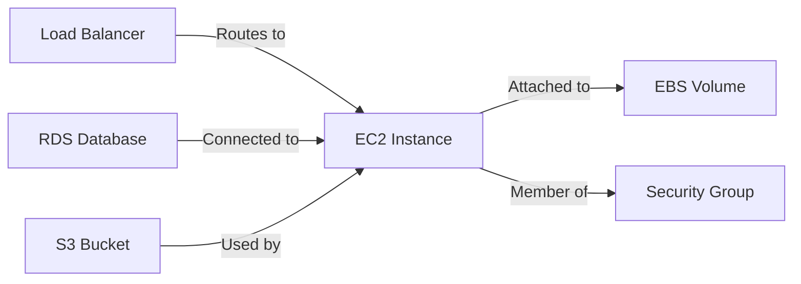

# Knowledge Graph

The Unpage Knowledge Graph is a comprehensive representation of your infrastructure that enables AI agents to understand and reason about your systems. It's a foundational component that provides the context needed for intelligent infrastructure operations.

## What is the Knowledge Graph?

At its core, the Knowledge Graph is a directed graph where:

- **Nodes** represent infrastructure resources (servers, databases, load balancers, etc.)
- **Edges** represent relationships between these resources (connections, dependencies, etc.)
- **Properties** store metadata about each resource (configuration, status, metrics availability, etc.)

This structure creates a rich, navigable map of your infrastructure that both humans and AI agents can use to understand system topology and relationships.

## How the Graph is Built

The Knowledge Graph is populated by [plugins](/concepts/plugins) during the `unpage graph build` process. Each enabled plugin contributes resources and relationships from the systems it integrates with:

1. **Authentication**: Plugins connect to infrastructure providers using configured credentials
2. **Discovery**: Plugins query APIs to discover resources and their metadata
3. **Node Creation**: Each discovered resource becomes a node with its properties
4. **Relationship Detection**: Plugins identify connections between resources
5. **Edge Creation**: These connections become edges in the graph
6. **Metadata Enrichment**: Additional capabilities like metrics/logs are noted

For example, the AWS plugin might discover EC2 instances, their security groups, attached volumes, and load balancer relationships—all represented as nodes and edges in the graph.



## Graph Structure

The Knowledge Graph has these fundamental components:

### Nodes

Nodes represent distinct infrastructure resources, each with:

- **Type**: What kind of resource it is (EC2 instance, RDS database, container, etc.)
- **ID**: A unique identifier for the resource
- **Name**: Human-readable name
- **Properties**: Configuration details, status information, etc.
- **Capabilities**: What operations can be performed on this resource

### Edges

Edges represent relationships between resources, capturing:

- **Source**: The originating node
- **Target**: The destination node
- **Type**: The nature of the relationship (connects_to, depends_on, etc.)
- **Properties**: Additional metadata about the relationship

### Special Attributes

Certain nodes have special attributes that enable additional functionality:

- **HasLogs**: Indicates log data is available for this resource
- **HasMetrics**: Indicates metric data is available for this resource
- **Alertable**: Resource can generate or receive alerts
- **Manageable**: Resource supports direct management operations

## Accessing the Graph

The Knowledge Graph can be accessed in multiple ways:

### Through Agents

[Agents](/concepts/agents) use the graph to gain context about your infrastructure when analyzing situations. They can traverse the graph to:

- Understand the topology around an affected resource
- Identify dependencies that might be impacted
- Find related metrics and logs
- Determine potential root causes

### Through Graph Tools

The Graph plugin provides tools that can be used directly:

- `graph_search_resources`: Find resources by name, type, or properties
- `graph_get_resource_details`: Get detailed information about a specific resource
- `graph_get_neighboring_resources`: Explore connections between resources
- `graph_get_resource_topology`: Visualize the neighborhood around a resource

### Through the CLI

You can interact with the graph directly via CLI commands:

```shell
# Build the graph
unpage graph build

# Visualize graph (outputs visualization options)
unpage visualize
```

## Use Cases

### Initial Setup

Build a complete representation of your infrastructure to give agents full context:

```shell
# Build the graph for the first time
unpage graph build
```

This creates the foundation for all agent operations, providing the context they need to understand your infrastructure.

### Continuous Updates

Keep the graph current with regular rebuilds to reflect infrastructure changes:

```shell
# Rebuild every hour
unpage graph build --interval 3600

# Run a background rebuild process
unpage graph build --background
```

This ensures agents always have up-to-date information when analyzing situations.

### Troubleshooting

When graph building encounters issues, investigate and resolve them:

```shell
# Check graph build logs
unpage graph logs

# Check if a background build is running
unpage graph status

# Stop a problematic background build
unpage graph stop
```

### Environment Management

Maintain separate graphs for different environments using profiles:

```shell
# Build graph for production
unpage graph build --profile production

# Build graph for staging
unpage graph build --profile staging
```

This allows agents to work with the appropriate context for each environment.

## Best Practices

To get the most value from your Knowledge Graph:

1. **Enable multiple plugins** to create a comprehensive view of your infrastructure
2. **Configure regular rebuilds** to keep the graph current
3. **Use profiles** to separate different environments or scopes
4. **Review graph build logs** to identify any connection issues
5. **Start with the most critical infrastructure** and expand coverage over time

## Graph Persistence

The Knowledge Graph is persisted to disk as a JSON document in your Unpage profile directory:

```
~/.unpage/profiles/<profile_name>/graph.json
```

This allows the graph to be loaded quickly when needed without rebuilding.

## Conclusion

The Knowledge Graph is the foundation that enables Unpage agents to understand your infrastructure context. By maintaining an accurate, comprehensive graph, you ensure that agents have the information they need to provide meaningful analysis and take appropriate actions.

For more information on how plugins populate the Knowledge Graph, see the [Plugins](/concepts/plugins) documentation.