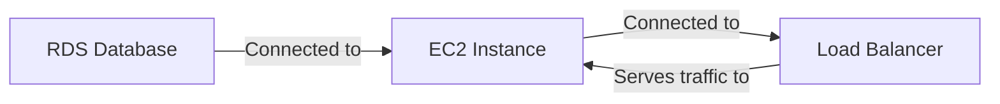

Plugins are the foundation of Unpage's extensible architecture, serving two essential purposes:

1. **Building the Knowledge Graph**: Plugins gather infrastructure data from various sources and add it to the [knowledge graph](/concepts/knowledge-graph).
2. **Providing LLM Tools**: Plugins expose capabilities to LLMs through MCP server [tools](/concepts/tools), enabling agents to interact with your infrastructure.

## Dual Purpose Architecture

Each plugin is designed to bridge the gap between your infrastructure and LLM-powered agents:

<AccordionGroup>
  <Accordion title="Knowledge Graph Population" icon="diagram-project">
    Plugins connect to infrastructure providers, observability tools, and other systems to:

    - Discover resources (instances, databases, clusters, etc.)
    - Collect metadata and properties from each resource
    - Identify relationships between resources
    - Add nodes and edges to the knowledge graph

    This happens during the `unpage graph build` process, creating a comprehensive representation of your infrastructure.
  </Accordion>

  <Accordion title="LLM Tool Exposure" icon="toolbox">
    The same plugins also:

    - Define tools that LLMs can use through the MCP protocol
    - Handle authentication and permissions for tool access
    - Process tool inputs and return structured outputs
    - Provide capabilities like querying metrics, accessing logs, and managing resources

    These tools become available when running `unpage mcp start` to launch the MCP server.
  </Accordion>
</AccordionGroup>

## Plugin Categories

Unpage plugins fall into several categories based on the systems they integrate with:

### Infrastructure Providers

These plugins connect to cloud platforms and infrastructure services:

- [AWS](/plugins/aws): Provides access to EC2 instances, RDS databases, load balancers, and more from Amazon Web Services
- [Kubernetes](/plugins/kubernetes): Integrates with Kubernetes clusters to access pods, deployments, services, and other resources
- [Aptible](/plugins/aptible): Connects to Aptible for container management, databases, and endpoints

### Observability Tools

These plugins bring logs and metrics into your knowledge graph:

- [Datadog](/plugins/datadog): Accesses metrics, logs, and monitors from Datadog
- [Papertrail](/plugins/papertrail): Retrieves logs from the Papertrail service
- [Metrics](/plugins/metrics): Provides a unified interface for metrics across different sources

### Core Functionality

These plugins provide essential capabilities:

- [Core](/plugins/core): Basic utility tools like datetime handling and calculations
- [Graph](/plugins/graph): Tools for traversing and querying the knowledge graph
- [Shell](/plugins/shell): Enables execution of predefined shell commands
- [Networking](/plugins/networking): Provides network diagnostic tools like ping and DNS lookups
- [PagerDuty](/plugins/pagerduty): Integrates with PagerDuty for incident management

## How Plugins Work

### Knowledge Graph Integration

When you run `unpage graph build`, each enabled plugin:

1. Authenticates with its corresponding service
2. Fetches resources and their metadata
3. Creates nodes in the graph with appropriate properties
4. Establishes relationships between nodes as edges
5. Adds metadata like logs access or metrics availability

For example, the AWS plugin might discover EC2 instances, their security groups, attached storage, and load balancer relationships—all added as nodes and edges in the graph.



### Tool Provision

When you start the MCP server with `unpage mcp start`, plugins register tools that become available to LLMs:

1. Tools are registered with the MCP server
2. Each tool has defined parameters and return types
3. LLMs can discover and use these tools through the FastMCP protocol
4. Plugin code handles the actual execution when tools are invoked

For instance, the Datadog plugin might provide tools to:
- Query metrics for a specific time range
- Search logs with custom filters
- Get alert status information

## Plugin Configuration

Plugins are configured during the `unpage configure` process, where you:

1. Enable or disable specific plugins
2. Provide authentication details (API keys, credentials)
3. Set plugin-specific options

Configuration is stored in `~/.unpage/profiles/<profile_name>/config.yaml`:

```yaml
plugins:
  aws:
    enabled: true
    accounts:
      default:
        profile: "production"
  datadog:
    enabled: true
    api_key: "your_api_key"
    app_key: "your_app_key"
```

## Extending with Custom Plugins

Unpage's plugin architecture is designed to be extensible. If you have internal systems or third-party services not covered by built-in plugins, you can develop custom plugins that:

1. Connect to your specific services
2. Add custom node types to the knowledge graph
3. Define tools tailored to your infrastructure needs
4. Integrate with your organization's authentication systems

## Conclusion

Plugins are the foundation of Unpage's ability to understand and interact with your infrastructure. By connecting to various services and providing both knowledge graph data and LLM tools, they enable agents to effectively analyze and respond to infrastructure issues.

To learn more about specific plugins and their capabilities, explore the individual plugin documentation in the [Plugins](/plugins/aws) section.
