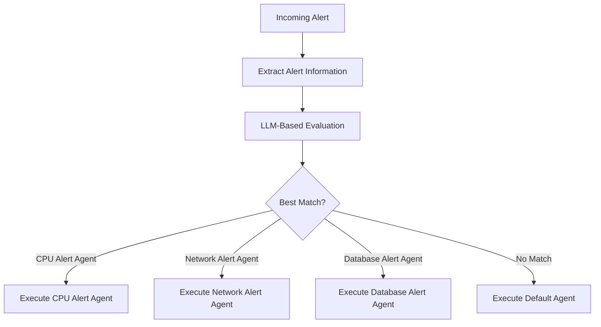

The Unpage Router is the intelligent system that determines which [agent](/concepts/agents) should handle an incoming alert or payload. Rather than requiring you to manually select the right agent for each situation, the Router automatically matches alerts to the most appropriate specialized agent.

## How Routing Works

The Router uses a specialized LLM-powered "routing agent" that evaluates incoming alerts against each agent's description. This process happens automatically when:

1. An alert arrives at the webhook endpoint (when running `unpage agent serve`)
2. You manually test routing with `unpage agent route`

### The Routing Process

When an alert is received, the Router follows these steps:

1. **Extract alert information**: Parse the incoming payload to understand what the alert is about
2. **Gather agent descriptions**: Collect the descriptions from all available agents
3. **LLM-based evaluation**: Use an LLM to analyze the alert against each agent's description criteria
4. **Select best match**: Choose the agent whose description best matches the alert context
5. **Execute selected agent**: Pass the alert to the chosen agent for analysis and response



- When an alert clearly matches a single agent's description, the Router directs it to that agent.
- When multiple agents might handle an alert, the Router selects the one with the most specific matching criteria.
- When no agent description clearly matches, the Router selects the default agent (if configured) or the most general-purpose agent.

## The Agent Description

The key to effective routing is well-written agent descriptions. Each agent's YAML configuration includes a `description` field that defines when that agent should be used:

```yaml
description: >
  Use this agent to analyze alerts that meet the following criteria:
    - The alert is related to database connectivity issues
    - The alert mentions timeouts, connection refused, or similar errors
    - The affected service is using PostgreSQL or MySQL
```

### Writing Effective Descriptions

To ensure accurate routing, follow these best practices for agent descriptions:

1. **Be specific** about the types of alerts the agent should handle
2. **Include distinguishing characteristics** that differentiate this alert type
3. **Mention source systems** like "AWS CloudWatch" or "Datadog"
4. **Reference affected resources** such as "EC2 instances" or "RDS databases"
5. **List alert patterns** using bullet points for clarity

## Testing the Router

You can test how the Router would handle specific alerts using the `route` command:

```bash
# Test with a JSON payload from a file
unpage agent route @path/to/alert.json

# Test with a direct JSON payload
unpage agent route '{"alert": "CPU usage exceeds 90%"}'

# Debug routing decisions
unpage agent route --debug '{"alert": "Memory usage exceeds threshold"}'
```

The `--debug` flag provides additional insight into why the Router selected a particular agent.

## Default Agent

If no agent's description sufficiently matches the incoming alert, the Router falls back to a default agent. The default agent has the following description:

```yaml
description: >
  Use this agent to analyze alerts that meet the following criteria:
    - Any alert that doesn't meet the criteria for any other agent
```

## Best Practices

To get the most out of the Router:

1. **Create specialized agents** rather than general-purpose ones
2. **Write clear, specific descriptions** for each agent
3. **Test routing with sample payloads** to verify correct agent selection
4. **Refine descriptions** based on routing results
5. **Include a default agent** to handle unexpected alerts

## Conclusion

The Unpage Router eliminates the need for complex manual alert routing rules by using LLM intelligence to match alerts to specialized agents. By writing clear agent descriptions and following best practices, you can ensure that each alert is handled by the most appropriate agent for efficient and effective incident response.