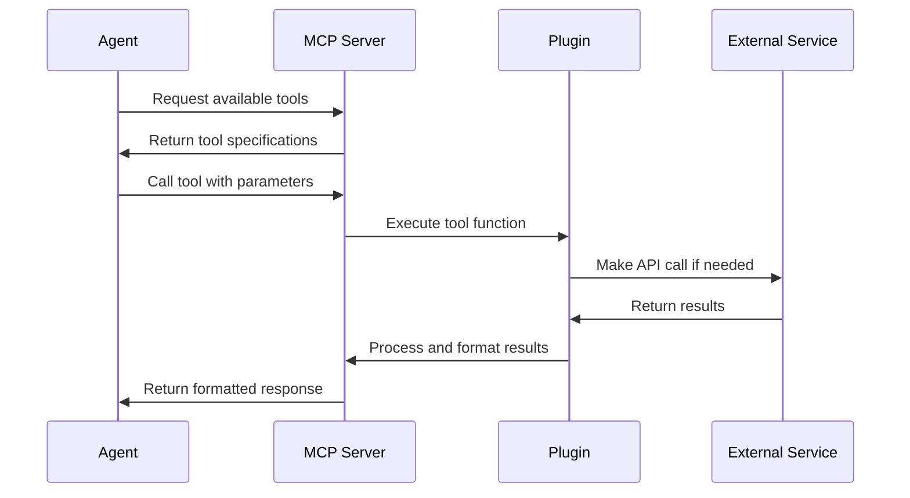

# Tools

Tools are the capabilities that allow Unpage agents to interact with your infrastructure and perform useful operations. They form the bridge between large language models (LLMs) and real-world systems, enabling AI to take meaningful actions based on its analysis.

## What are Tools?

In Unpage, tools are:

1. **Function interfaces** that LLMs can call with specific parameters
2. **Task-specific capabilities** provided by plugins
3. **Permission-controlled actions** that can query or modify infrastructure
4. **Structured interfaces** with defined inputs and outputs

Tools follow the FastMCP protocol, which enables structured interaction between LLMs and external systems while maintaining appropriate security boundaries.

## Tool Categories

Unpage provides tools across several categories, each serving different operational needs:

### Infrastructure Query Tools

These tools allow agents to gather information about your infrastructure:

- **Resource discovery**: Find resources matching specific criteria
- **Resource details**: Get comprehensive information about specific resources
- **Relationship exploration**: Understand connections between resources
- **Configuration inspection**: Examine settings and properties

Example: `aws_describe_ec2_instance`, `kubernetes_get_pod_details`

### Metrics and Monitoring Tools

These tools provide access to operational data:

- **Metrics retrieval**: Get time-series data about resource performance
- **Metrics exploration**: Discover available metrics for resources
- **Anomaly detection**: Identify unusual patterns in metrics
- **Alert status**: Check on the current state of alerts

Example: `metrics_get_metrics_for_node`, `datadog_get_monitor_status`

### Log Analysis Tools

These tools enable investigation of log data:

- **Log search**: Find relevant log entries across systems
- **Log filtering**: Narrow down log results by time or content
- **Pattern analysis**: Identify recurring patterns in logs
- **Error extraction**: Focus on error and warning messages

Example: `papertrail_search_logs`, `datadog_search_logs`

### Network Diagnostic Tools

These tools help troubleshoot connectivity issues:

- **Connectivity checks**: Verify network paths are working
- **DNS lookups**: Resolve hostnames to IP addresses
- **Route tracing**: Examine network paths between resources
- **HTTP requests**: Test web endpoints

Example: `networking_ping`, `networking_traceroute`

### Utility Tools

These tools provide general-purpose functionality:

- **Date/time operations**: Handle timezone conversions and formatting
- **Calculations**: Perform mathematical operations
- **Text processing**: Format and manipulate strings
- **Data conversion**: Transform between different data formats

Example: `core_current_datetime`, `core_convert_to_timezone`

### Action Tools

These tools can modify state or take actions:

- **Status updates**: Post updates to incident management systems
- **Resource operations**: Start, stop, or modify resources
- **Configuration changes**: Update settings or configurations
- **Alerts management**: Acknowledge or resolve alerts

Example: `pagerduty_post_status_update`, `aws_restart_ec2_instance`

## How Tools Work

Tools operate through a structured mechanism:

1. **Registration**: Plugins register tools with the MCP server during startup
2. **Discovery**: Agents discover available tools through the MCP protocol
3. **Invocation**: Agents call tools with specific parameters
4. **Execution**: The plugin executes the requested action
5. **Response**: Results are returned to the agent for further analysis



## Tool Access Control

Tools implement a permission model that ensures agents only have access to the capabilities they need:

### Agent-Level Access

In each agent's YAML configuration, the `tools` section explicitly grants permission to use specific tools:

```yaml
tools:
  - "core_current_datetime"
  - "metrics_get_metrics_for_node"
  - "graph_get_resource_details"
  - "papertrail_search_logs"
```

You can use wildcards and patterns to grant access to groups of tools:

```yaml
tools:
  # Allow all metrics tools
  - "metrics_*"
  # Allow all tools except those that modify resources
  - "/^(?!.*_modify_|.*_delete_|.*_create_).*$/"
```

### Plugin-Level Access

Plugins may implement additional access controls based on:

- Authentication to external services
- User roles and permissions
- Resource-specific access control
- Rate limiting and quotas

## Using Tools Directly

You can use tools directly from the command line without going through an LLM, which is useful for:

### Debugging

Test tools and understand their behavior:

```bash
# Test a tool with specific parameters
unpage mcp tools call metrics_get_metrics_for_node --node-id i-0abc123def456 --metric cpu_utilization

# See detailed output structure
unpage mcp tools call graph_get_resource_details --resource-id i-0abc123def456 | jq
```

### Automation

Use tools in scripts and automation workflows:

```bash
# Use in a script to get current CPU usage
CPU_USAGE=$(unpage mcp tools call metrics_get_metrics_for_node --node-id i-0abc123def456 --metric cpu_utilization --last 5m | jq '.avg')

# Check if CPU usage is above threshold
if (( $(echo "$CPU_USAGE > 80" | bc -l) )); then
  echo "High CPU usage detected!"
fi
```

### Development

Understand available tools when creating new agents:

```bash
# List all available tools
unpage mcp tools list

# List tools matching a pattern
unpage mcp tools list | grep aws_
```

## Tool Schema

Each tool has a defined schema that specifies:

- **Name**: Unique identifier for the tool
- **Description**: Human-readable explanation of what the tool does
- **Parameters**: Required and optional inputs with types and constraints
- **Return Type**: Structure and format of the returned data

For example, a metrics tool might have this schema:

```json
{
  "name": "metrics_get_metrics_for_node",
  "description": "Get metrics data for a specific node",
  "parameters": {
    "type": "object",
    "properties": {
      "node_id": {
        "type": "string",
        "description": "ID of the node to get metrics for"
      },
      "metric": {
        "type": "string",
        "description": "Name of the metric to retrieve"
      },
      "start_time": {
        "type": "string",
        "description": "ISO8601 timestamp for start of range"
      },
      "end_time": {
        "type": "string",
        "description": "ISO8601 timestamp for end of range"
      },
      "aggregation": {
        "type": "string",
        "enum": ["avg", "max", "min", "sum"],
        "default": "avg",
        "description": "Aggregation function to use"
      }
    },
    "required": ["node_id", "metric"]
  },
  "returns": {
    "type": "object",
    "properties": {
      "datapoints": {
        "type": "array",
        "items": {
          "type": "object",
          "properties": {
            "timestamp": {
              "type": "string",
              "format": "date-time"
            },
            "value": {
              "type": "number"
            }
          }
        }
      },
      "min": {"type": "number"},
      "max": {"type": "number"},
      "avg": {"type": "number"}
    }
  }
}
```

## Best Practices

To get the most value from tools:

1. **Follow least privilege**: Grant agents access only to the tools they need
2. **Test tools independently**: Use `unpage mcp tools call` to understand behavior
3. **Use structured parameters**: Provide complete parameter objects
4. **Handle errors gracefully**: Account for potential tool failures in agent prompts
5. **Chain tool calls**: Build complex workflows by combining multiple tool calls

## Conclusion

Tools are what make Unpage agents truly useful by enabling them to interact with your actual infrastructure. By providing a secure, structured interface for LLMs to access and manipulate systems, tools bridge the gap between AI understanding and real-world operations.

For more information on the specific tools available from each plugin, refer to the individual [plugin documentation](/plugins/aws).
